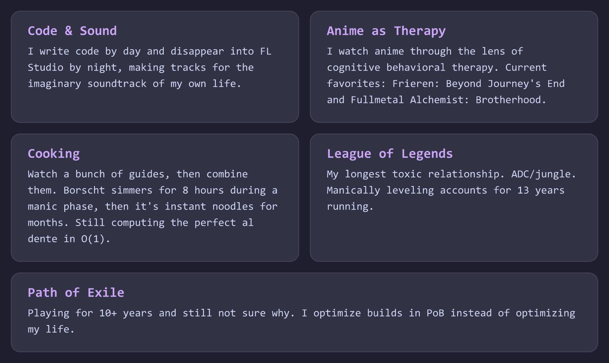
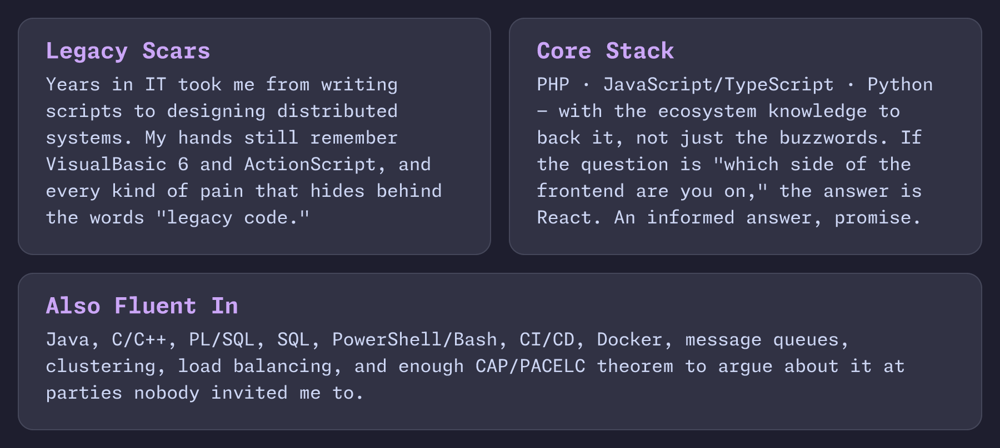

 

> Apparently (see: [impostor syndrome](https://en.wikipedia.org/wiki/Impostor_syndrome)) a senior full-stack developer with bipolar disorder.

<picture>
  <source media="(prefers-color-scheme: dark)" srcset="https://ym-nowplaying-widget.vercel.app/api/nowplaying?theme=dark" />
  <source media="(prefers-color-scheme: light)" srcset="https://ym-nowplaying-widget.vercel.app/api/nowplaying?theme=light" />
  
</picture>

<picture>
  <source media="(prefers-color-scheme: dark)" srcset="assets/cards-dark.png" />
  <source media="(prefers-color-scheme: light)" srcset="assets/cards-light.png" />
  
</picture>

<picture>
  <source media="(prefers-color-scheme: dark)" srcset="assets/stack-dark.png" />
  <source media="(prefers-color-scheme: light)" srcset="assets/stack-light.png" />
  
</picture>

 

  

<picture>
  <source media="(prefers-color-scheme: dark)" srcset="https://raw.githubusercontent.com/sm-steel/sm-steel/output/github-contribution-grid-snake-dark.svg" />
  <source media="(prefers-color-scheme: light)" srcset="https://raw.githubusercontent.com/sm-steel/sm-steel/output/github-contribution-grid-snake.svg" />
  
</picture>

 

<picture>
  <source media="(prefers-color-scheme: dark)" srcset="https://mal-stats-widget.vercel.app/api/mal?theme=dark" />
  <source media="(prefers-color-scheme: light)" srcset="https://mal-stats-widget.vercel.app/api/mal?theme=light" />
  
</picture>

 

 

