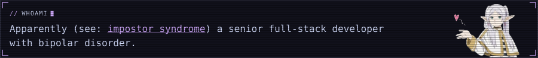
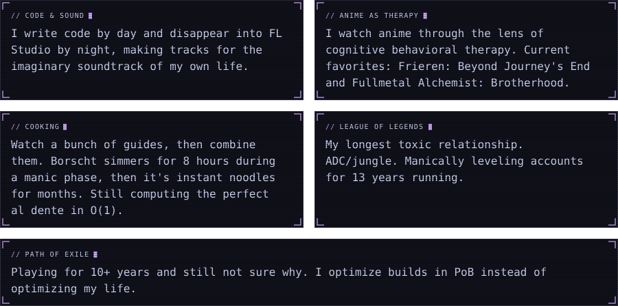
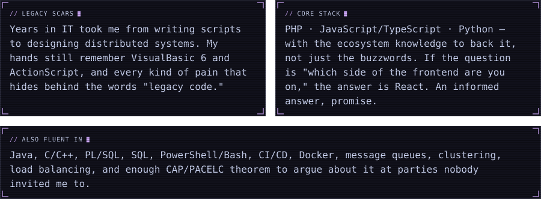
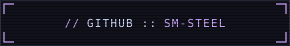
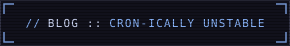
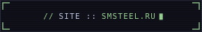
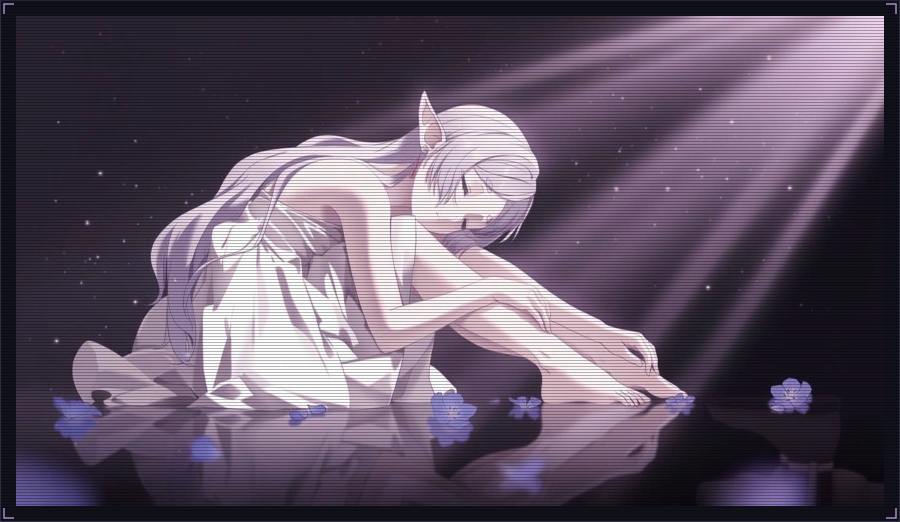

<a href="https://en.wikipedia.org/wiki/Impostor_syndrome"><picture><source media="(prefers-color-scheme: dark)" srcset="assets/whoami-dark.svg" /><source media="(prefers-color-scheme: light)" srcset="assets/whoami-light.svg" /></picture></a>

<picture>
  <source media="(prefers-color-scheme: dark)" srcset="https://ym-nowplaying-widget.vercel.app/api/recent?theme=dark" />
  <source media="(prefers-color-scheme: light)" srcset="https://ym-nowplaying-widget.vercel.app/api/recent?theme=light" />
  
</picture>

<picture>
  <source media="(prefers-color-scheme: dark)" srcset="assets/bio-dark.svg" />
  <source media="(prefers-color-scheme: light)" srcset="assets/bio-light.svg" />
  
</picture>

<picture>
  <source media="(prefers-color-scheme: dark)" srcset="assets/stack-dark.svg" />
  <source media="(prefers-color-scheme: light)" srcset="assets/stack-light.svg" />
  
</picture>

<picture>
  <source media="(prefers-color-scheme: dark)" srcset="https://raw.githubusercontent.com/sm-steel/sm-steel/output/stats-dark.svg" />
  <source media="(prefers-color-scheme: light)" srcset="https://raw.githubusercontent.com/sm-steel/sm-steel/output/stats.svg" />
  
</picture>

<picture>
  <source media="(prefers-color-scheme: dark)" srcset="https://raw.githubusercontent.com/sm-steel/sm-steel/output/contrib-neon-dark.svg" />
  <source media="(prefers-color-scheme: light)" srcset="https://raw.githubusercontent.com/sm-steel/sm-steel/output/contrib-neon.svg" />
  
</picture>

<picture>
  <source media="(prefers-color-scheme: dark)" srcset="https://mal-stats-widget.vercel.app/api/mal?theme=dark" />
  <source media="(prefers-color-scheme: light)" srcset="https://mal-stats-widget.vercel.app/api/mal?theme=light" />
  
</picture>

<a href="https://github.com/sm-steel"><picture><source media="(prefers-color-scheme: dark)" srcset="assets/badge-github-dark.svg" /><source media="(prefers-color-scheme: light)" srcset="assets/badge-github-light.svg" /></picture></a><a href="https://t.me/cronically_unstable"><picture><source media="(prefers-color-scheme: dark)" srcset="assets/badge-blog-dark.svg" /><source media="(prefers-color-scheme: light)" srcset="assets/badge-blog-light.svg" /></picture></a><a href="https://smsteel.ru"><picture><source media="(prefers-color-scheme: dark)" srcset="assets/badge-site-dark.svg" /><source media="(prefers-color-scheme: light)" srcset="assets/badge-site-light.svg" /></picture></a>

<picture>
  <source media="(prefers-color-scheme: dark)" srcset="assets/footer-dark.svg" />
  <source media="(prefers-color-scheme: light)" srcset="assets/footer-light.svg" />
  
</picture>

